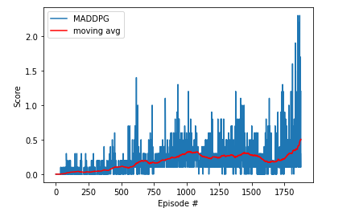

# Project Report

### Introduction

This project implements the [Multi-Agent DDPG algorithm](https://arxiv.org/abs/1706.02275) to solve the 2-agent Tennis Unity environment. 

Recall that DDPG is an off-policy actor-critic, model-free algorithm based on the deterministic policy gradient that can operate over continuous action spaces. The "Actor" updates the policy distribution in the direction suggested by the Critic (such as with policy gradients), and the "Critic" estimates the value function, which could be the action-value (the Q value) or state-value (the V value). During the learning period, both Actor and Critic have two networks–a local network to update the training parameters, and a target network for evaluation of the performance. To update the local network, a soft update is introduced, which use a fraction $\tau$ of the local network parameters, and $1 - \tau$ of the target parameters to update the target network. ($\tau$ is one of several hyperparameters used in the implementation–see complete list below.) In addition, to allow for exploration of the network, a noise term derived from a Ornstein–Uhlenbeck process is added to the actions.

The implementation borrows code from Project 2, adapted to work for the multi-agent setting.

#### Multi-Agent DDPG

From the [paper](https://arxiv.org/abs/1706.02275) cited above, we learn that traditional reinforcement learning approaches such as Q-Learning or policy gradient are poorly suited to multi-agent environments. One issue is that each agent’s policy is changing as training progresses, and the environment becomes non-stationary from the perspective of any
individual agent (in a way that is not explainable by changes in the agent’s own policy). This presents learning stability challenges and prevents the straightforward use of past experience replay, which is crucial for stabilizing deep Q-learning. Policy gradient methods, on the other hand, usually exhibit
very high variance when coordination of multiple agents is required. The authors propose a framework of centralized training with decentralized execution, allowing the policies to use extra information to ease training, so long as this information is not used at test time. It is a simple extension of actor-critic policy gradient methods where the critic is
augmented with extra information about the policies of other agents, while the actor only has access to local information. After training is completed, only the local actors are used at execution phase, acting in a decentralized manner.

### Training the Agents

To be honest, training the agents was an exercise in frustration. I carried out close to 50 experiments over a two-week period using different values of hyperparameters (initially using grid search and subsequently with a random strategy), and failed most of the time to find a combination that would converge in a reasonable number of episodes. In the end, I had to borrow from results documented by fellow students to arrive at a set of hyperparameters that finally worked. See the acknowledgements section at the end of this report.

In order to solve the environment, the agents must get an average score of +0.5 (over 100 consecutive episodes, after taking the maximum over both agents).

DDPG employs Actor-Critic networks with Experience Replay. In our implementation, both Actor and Critic utilized a neural network with two hidden, fully-connected layers having 256 and 128 nodes respectively, interspersed with ReLU activation.

The network was tuned by reducing MSE loss using the Adam optimizer with a learning rate of 1e-3. Training was carried out in minibatches of size 128.

Here is the complete list of hyperparameters:
```python
BUFFER_SIZE = 1e6       # replay buffer size
BATCH_SIZE = 128        # minibatch size
LR_ACTOR = 1e-3         # learning rate of the actor
LR_CRITIC = 1e-3        # learning rate of the critic
WEIGHT_DECAY = 0        # L2 weight decay
LEARN_EVERY = 1         # learning timestep interval
LEARN_NUM = 5           # number of learning passes
GAMMA = 0.99            # discount factor
TAU = 8e-3              # for soft update of target parameters
OU_SIGMA = 0.2          # Ornstein-Uhlenbeck noise parameter, volatility
OU_THETA = 0.15         # Ornstein-Uhlenbeck noise parameter, speed of mean reversion
EPS_START = 5.0         # initial value for epsilon in noise decay process in Agent.act()
EPS_EP_END = 300        # episode to end the noise decay process
EPS_FINAL = 0           # final value for epsilon after decay
```
### Rewards

The image below plots the rewards per episode obtained during training. Console logs show that the agents are able to receive an average reward (over 100 episodes) of +0.5 in 1776 episodes.



### Improving the Agent

To improve the performance, the authors of MADDPG suggest training agents with an ensemble of policies, an approach believed to be generally applicable to any multi-agent algorithm.
One downside to the implemented approach is that the input space of Q grows linearly with the number of agents N. This could be remedied in practice by,
for example, having a modular Q function that only considers agents in a certain neighborhood of a given agent.

Finally, we could also tweak hyperparameter values and train network layers of different sizes. The current implementation can be augmented with Batch Normalization layer; additional such layers could be introduced following the fully-connected layers and evaluated. 

### Acknowledgements

Many thanks to former student Tommy Tracey for sharing his [results](https://github.com/tommytracey/DeepRL-P3-Collaboration-Competition). I found his code and documentation extremely helpful in debugging my own project, and ended up borrowing the combination of hyperparameters that he used, after two weeks of failed experiments.

If some of the project code resembles that from [Project 2: Continuous Control](https://github.com/samirbajaj/rl-continuous-control), that's no coincidence. Most of the agent and training code was essentially reused, because Multi-Agent DDPG is (at a fundamental level), an adaptation of DDPG.
